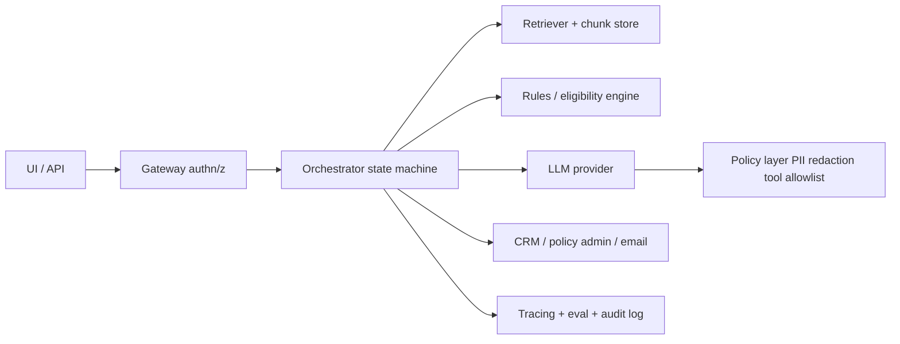

# CTO round prep — agentic AI × insurance (system design)

This document is for a **technical leadership conversation** (often a CTO or VP Engineering): **systems thinking**, **agentic architectures**, and how they apply to **insurance** products. It is **broader than this repository**; a dedicated section ties ideas back to **this RAG / copilot project** so you can pivot the conversation naturally.

**How to use it**

- Skim **§1–2** before the call (framing + domain actors).
- Use **§3–6** as a mental checklist when they ask “design an agent system for X.”
- Use **§7** for whiteboard structure (components, data, failure modes).
- Use **§10** if the discussion stays close to **your portfolio repo**.

---

## Table of contents

1. [What the CTO round is really testing](#1-what-the-cto-round-is-really-testing)  
2. [Insurance domain — who does what (plain language)](#2-insurance-domain--who-does-what-plain-language)  
3. [Core insurance vocabulary (short glossary)](#3-core-insurance-vocabulary-short-glossary)  
4. [Lines of business and “where the money moves”](#4-lines-of-business-and-where-the-money-moves)  
5. [Regulation, filings, and why software is hard in insurance](#5-regulation-filings-and-why-software-is-hard-in-insurance)  
6. [Agentic systems — definitions and mental model](#6-agentic-systems--definitions-and-mental-model)  
7. [System design blueprint (generic, reusable)](#7-system-design-blueprint-generic-reusable)  
8. [Insurance-specific agentic patterns (examples to cite)](#8-insurance-specific-agentic-patterns-examples-to-cite)  
9. [Evaluation, safety, and governance (what CTOs listen for)](#9-evaluation-safety-and-governance-what-ctos-listen-for)  
10. [This project — where agents help without over-claiming](#10-this-project--where-agents-help-without-over-claiming)  
11. [Likely CTO questions — concise answer templates](#11-likely-cto-questions--concise-answer-templates)  
12. [Closing — how to sound senior in 30–45 minutes](#12-closing--how-to-sound-senior-in-3045-minutes)

---

## 1. What the CTO round is really testing

They already liked your **CEO story** (problem, impact, clarity). The CTO round usually shifts to:

| Dimension | What “good” sounds like |
|-----------|-------------------------|
| **Decomposition** | You break fuzzy goals into services, data contracts, and human-in-the-loop boundaries. |
| **Trade-offs** | Latency vs accuracy, batch vs online, cost vs coverage, centralized vs federated models. |
| **Operational reality** | Idempotency, retries, observability, versioning, drift, incident response, audit trails. |
| **Risk** | PII/PHI, model misuse, regulatory exposure, silent automation in binding coverage. |
| **Agent hype vs engineering** | Agents are **orchestrated workflows** with **tools** and **policies**—not magic autonomy. |

**One sentence you can use:** “I treat agentic systems as **policy-governed orchestration** over **tools and data**, with **explicit evaluation** and **human checkpoints** wherever money or compliance is on the line.”

---

## 2. Insurance domain — who does what (plain language)

Insurance is a **risk transfer**: someone pays **premium**; the insurer promises to pay **claims** according to a **contract** (the **policy**). Between the customer and the insurer sits a web of **distribution**, **capital**, **services**, and **regulators**.

### 2.1 The insured (policyholder)

The **insured** is the person or organization **protected** by the policy (or named on it). They pay premium (directly or via an employer/plan sponsor).

### 2.2 The insurer (carrier, insurance company)

The **insurer** / **carrier** is the legal entity that **assumes risk** and backs the promise to pay claims. It must be **licensed** (or operate under specific exemptions) in the jurisdictions where it does business.

### 2.3 The producer — “who sells insurance”

In U.S. regulatory language, a **producer** is a broad term that includes **agents** and **brokers** (definitions vary slightly by state). If someone asks “who sells insurance?”, the accurate answer is usually: **licensed producers** acting on behalf of carriers or clients, under state rules.

- **Captive agent:** represents **one** insurer (or a family of related carriers).
- **Independent agent:** represents **multiple** carriers; often sells personal/commercial lines locally.
- **Broker:** typically represents the **client’s** interests in placing coverage (especially commercial). In practice, “agent” vs “broker” overlaps; states license **producer** authority.

**Interview tip:** Say “**producer** is the regulatory umbrella; **agent/broker** describe **who you represent** and **how you get paid**.”

### 2.4 Wholesaler vs retailer (distribution shorthand)

- **Retail producer:** sells to the end customer (individual or business).
- **Wholesale broker:** specializes in placing **hard-to-place** risks, often into **E&S** markets; may work with retail brokers.

### 2.5 MGA / MGU — “IMG” is usually a typo for this

People often say **IMG** when they mean **MGA** (or occasionally **MGU**).

- **MGA (Managing General Agent):** a specialized distributor with **delegated authority** from an insurer—can **underwrite**, **bind** coverage, **price**, sometimes **handle claims** within defined limits. MGAs are common in niche programs (cyber, flood, specialty auto fleets, etc.).
- **MGU (Managing General Underwriter):** similar idea but emphasizes **underwriting** capacity management; usage varies by market.

**Why CTOs care:** MGAs are **software + data** businesses disguised as distribution. Agentic workflows (triage, document intake, rules + model) often land here first.

### 2.6 TPAs (Third-Party Administrators)

**TPAs** administer plans or claims **on behalf of** insurers or self-insured employers: claims processing, network management, reporting. They touch **sensitive data** and **SLA-heavy** workflows—classic ground for automation **with** strict controls.

### 2.7 Adjusters

**Adjusters** investigate and settle **claims**: coverage determination, reserves, payments. Staff adjusters work for carriers; **independent adjusters** may handle CAT (catastrophe) surges.

### 2.8 Reinsurance (high level)

**Reinsurers** insure insurers—capacity and capital management for large or correlated losses. Relevant when discussing **catastrophe modeling**, **aggregate limits**, and **capital stress**.

### 2.9 Surplus lines / E&S (Excess & Surplus)

When standard admitted carriers won’t cover a risk (novel, high hazard, non-standard), coverage may be placed in **non-admitted** / **E&S** markets, often via **surplus lines brokers** and **slip** paperwork—**heavily regulated** at state level (e.g., diligence, tax, stamping). Your portfolio repo’s title nods to this space.

---

## 3. Core insurance vocabulary (short glossary)

| Term | Plain meaning |
|------|----------------|
| **Premium** | Price paid for coverage over a period. |
| **Deductible** | Amount the insured pays before the insurer pays (depending on line/contract). |
| **Limit** | Maximum the insurer will pay (per occurrence, aggregate, etc.). |
| **Endorsement / rider** | Amendment modifying the base policy. |
| **Binder** | Short-term evidence of coverage until policy is issued (varies by practice). |
| **Underwriting** | Assessing risk, pricing, deciding to accept/decline/modify terms. |
| **Claims** | Event where the insured seeks indemnity/benefits per contract. |
| **Loss ratio** | Claims costs relative to premium—core health metric of a book. |
| **Admitted vs non-admitted** | Whether the carrier/filed product is approved in the state (oversimplified but useful in interviews). |
| **Rate / form filing** | Regulatory submission of pricing/rules or contract language. |
| **Fraud** | Material misrepresentation or organized abuse—big ML + rules area. |

---

## 4. Lines of business and “where the money moves”

You don’t need to be an actuary—CTOs like **workflow literacy**:

| Line | What “work” looks like in software |
|------|-------------------------------------|
| **Personal P&C** | Quote/bind, endorsements, FNOL (first notice of loss), repair networks. |
| **Commercial** | Schedules, locations, certificates of insurance, layered programs. |
| **Workers’ comp** | Payroll class codes, experience mods, state bureaus. |
| **Health** | HIPAA, eligibility, networks, prior auth (different beast from P&C). |
| **Life / annuities** | Suitability, illustrations, long-term persistency. |

**Agentic angle:** pick a **bounded workflow** (e.g., “intake + triage + draft”) not “replace the underwriter.”

---

## 5. Regulation, filings, and why software is hard in insurance

CTOs respect candidates who understand **why** shipping is slow:

- **State-by-state** variation: licensing, marketing, unfair trade practices, data breach laws.
- **Filings** tie **model outputs** to **approved** rates/forms—you cannot silently “ship a new prompt” that changes pricing without process in many contexts.
- **Auditability:** regulators and legal want **traceability** (who decided what, based on what data).
- **Consumer harm:** coverage gaps are not “bad UX”—they’re existential.

**Good phrase:** “We separate **experimental** models from **binding** systems with gates, versioning, and approvals.”

---

## 6. Agentic systems — definitions and mental model

### 6.1 What “agentic” usually means in 2024–2026 product speech

An **agentic system** is typically:

1. A **planner** (LLM or rules) that selects **steps** toward a goal.  
2. **Tools** (APIs, DB queries, retrievers, calculators, ticketing).  
3. A **state** representation (ticket, case file, policy JSON).  
4. **Policies** (permissions, spend limits, allowed tools, PII redaction).  
5. **Termination conditions** (done, escalate, fail closed).

It is **not** required to be “multi-agent.” A solid **single-agent + router** often wins.

### 6.2 Multi-agent vs single-agent

| Approach | Pros | Cons |
|---------|------|------|
| **Single agent + tool router** | Simpler ops, easier tracing | Prompt bloat; tool selection errors |
| **Multi-agent** | Role separation, parallelization | Coordination overhead, harder debugging |

**Senior take:** Start **single**; split agents when **ownership boundaries** or **latency** justify it.

### 6.3 Common patterns

- **ReAct-style loop:** think → act (tool) → observe → repeat.  
- **Planner / executor:** cheap planner, constrained worker.  
- **Human-in-the-loop:** approvals for bind, payments, adverse actions.  
- **Retrieval-first:** your RAG mental model—ground answers in corpuses.  
- **Deterministic guardrails:** rules engine + LLM draft + validator.

---

## 7. System design blueprint (generic, reusable)

When asked to “design it,” walk through this **order**:

### 7.1 Clarify scope (30–60 seconds)

- Lines of business? Personal vs commercial?  
- Admitted vs E&S?  
- Who is the user: insured, CSR, adjuster, underwriter, broker?  
- What is **automated** vs **drafted** vs **recommended**?

### 7.2 Define the “case object”

Everything hangs off a canonical record, e.g.:

`Case { id, tenant, pii_tier, state, lob, status, artifacts[], decisions[], audit[] }`

### 7.3 Architecture sketch

### 7.4 Data plane vs control plane

- **Data plane:** documents, embeddings, feature store, transactional policy DB (often not LLM-native).  
- **Control plane:** auth, approvals, model versions, prompt templates, eval suites, feature flags.

### 7.5 Failure modes (say these out loud)

- Tool misuse / hallucinated parameters  
- **Over-automation** on regulated decisions  
- **Data leakage** across tenants  
- **Stale retrieval** (wrong policy edition)  
- **Cost spikes** (runaway loops)

### 7.6 Non-functional requirements

- **Latency budgets** (CSR chat vs batch underwriting)  
- **Idempotency** for payments/bind  
- **SLOs** and on-call  
- **DR / backups** for evidence stores

---

## 8. Insurance-specific agentic patterns (examples to cite)

Pick 2–3 and go deep rather than listing twenty.

### 8.1 Intake → triage → draft (FNOL / underwriting)

- **Tools:** OCR, classification, retrieval over policy PDFs, FNOL form APIs.  
- **Human:** approve coverage determination on ambiguous claims.

### 8.2 Coverage Q&A copilot (internal)

- **Grounding** in endorsements + manuals; **no** silent binding.  
- **Citations** to clause IDs; version pinning (“policy edition effective date”).

### 8.3 Broker submission scrubbing

- Normalize schedules, detect missing limits, map NAICS to hazard classes.  
- **Agent** proposes fixes; **human** submits to carrier portal.

### 8.4 Compliance monitoring

- Scan marketing copy vs **filings**; diff detection; ticket to legal.  
- Strong **rules + retrieval**; LLM as classifier second stage.

### 8.5 Fraud / SIU support (support, not “Minority Report”)

- Anomaly scoring + explanation artifacts; strict governance.

---

## 9. Evaluation, safety, and governance (what CTOs listen for)

### 9.1 Evaluation layers

1. **Unit:** tool JSON schema validation, golden retrieval IDs.  
2. **Task:** end-to-end scenarios with rubrics.  
3. **Online:** shadow mode, human review rates, regression monitors.

### 9.2 Safety stack (practical)

- **Prompt injection** defenses at gateway + tool layer  
- **Output filtering** (PII redaction, disallowed advice)  
- **Allowlisted tools** (no arbitrary URLs)  
- **Budgets** (max steps, max tokens, max cost)

### 9.3 Observability

- Trace IDs per case  
- Span per tool call with inputs/outputs redacted  
- “Model version + prompt version + retrieval corpus version” triple

### 9.4 Responsible positioning

- Clear **disclaimers** for consumer-facing assistants  
- **Escalation paths** and **audit logs** for adverse decisions

---

## 10. This project — where agents help without over-claiming

Your repo is primarily a **retrieval-augmented** stack (hybrid search, rerank, streaming answers) plus a **copilot-style** underwriting demo—not a full autonomous agent platform. That is a **strength** in a CTO conversation if framed as **Phase 1** of a roadmap.

| Capability today | Agentic extension (honest “next steps”) |
|------------------|----------------------------------------|
| Hybrid RAG over statutes/PDFs | **Planner** decides when to retrieve vs ask clarifying question vs escalate. |
| Streaming chat | **Tool-using** steps: “fetch endorsement v3,” “compare to filing PDF.” |
| Copilot risk scoring | **Multi-step** workflow: ingest → extract entities → call pricing API → explain via SHAP-like summaries **with** human approval. |
| URL / grounding hygiene | **Validator agent** (deterministic) checks citations against allowlists—pattern you already discussed implementing. |

**Sound-bite:** “Today it’s **RAG + UX**; agentic value is **orchestrating** retrieval, rules engines, and human approvals into **repeatable case workflows** with measurable quality.”

---

## 11. Likely CTO questions — concise answer templates

**Q: When would you *not* use agents?**  
A: When **deterministic** rules suffice, when **audit** requires a single code path, or when **latency/cost** can’t tolerate multi-step LLM loops—use agents for **language-heavy** variability at the edges.

**Q: How do you prevent catastrophic autonomy?**  
A: **HITL gates**, **tool allowlists**, **schema validation**, **dry-run/shadow**, **separate** environments for experimental models.

**Q: How do you test retrieval systems?**  
A: **Golden sets** with expected doc IDs, nDCG/MRR offline, plus **human rubrics** for groundedness; monitor **query drift** and **corpus updates**.

**Q: Multi-agent or not?**  
A: Default **single orchestrator**; split when teams/SLAs differ or when **context isolation** reduces error propagation.

**Q: Biggest insurance-specific risk?**  
A: **Silent wrong coverage**—treat any automated bind/decline as a **regulated workflow**, not a chat feature.

**Q: How do you think about vendor LLMs vs self-host?**  
A: Trade **latency, privacy, control, cost**, and **contractual BAU** terms; often hybrid (small local classifier + cloud LLM for drafts).

---

## 12. Closing — how to sound senior in 30–45 minutes

1. **Start with the workflow** (who acts, what decision, what evidence).  
2. **Draw boundaries** between draft vs decide vs bind.  
3. **Name failure modes** before they do.  
4. **Tie tech to economics:** loss ratio, cycle time, compliance cost, broker NPS.  
5. **Stay honest** about what your repo proves vs what you’d build next.

You already cleared the CEO bar on narrative. For the CTO, **show you can ship systems**, not just demos—and that you respect **insurance as a regulated control problem**, not only an NLP problem.

Good luck in the next round.
