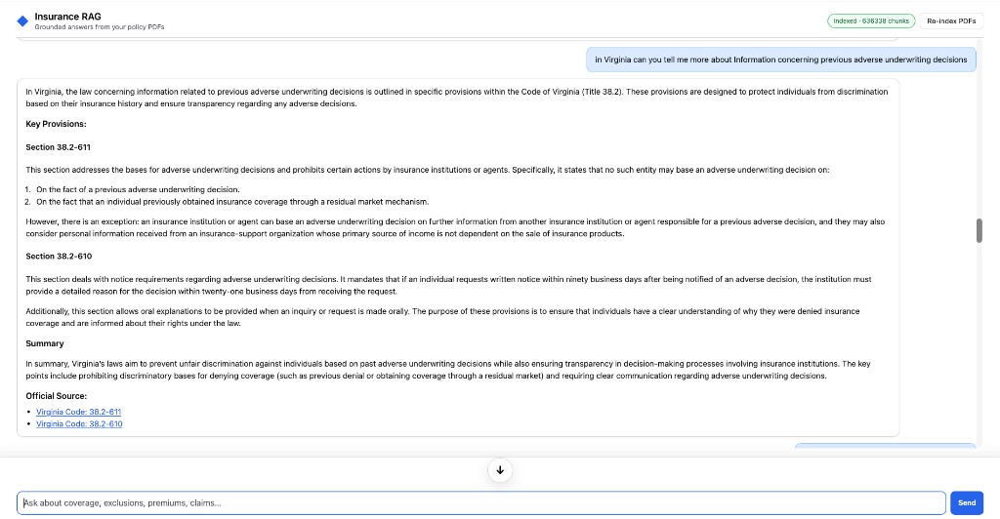
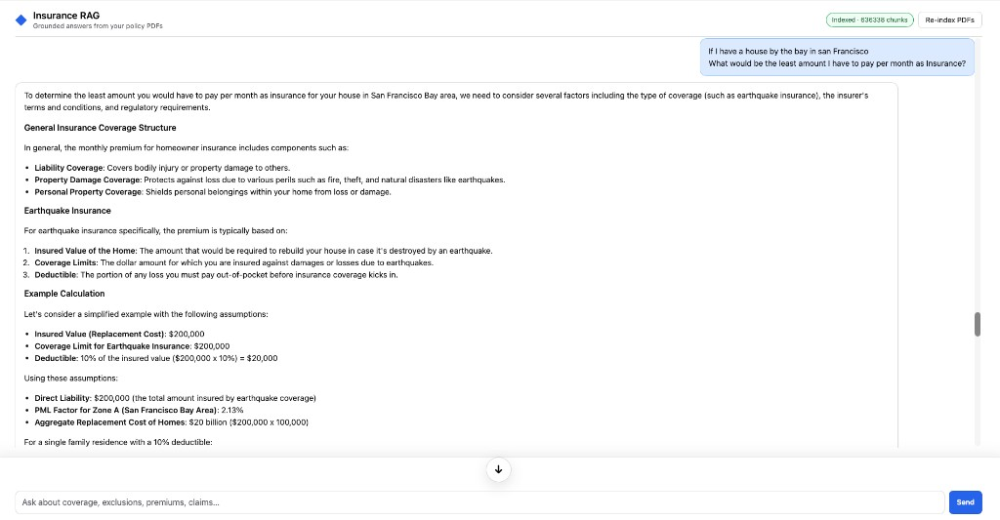
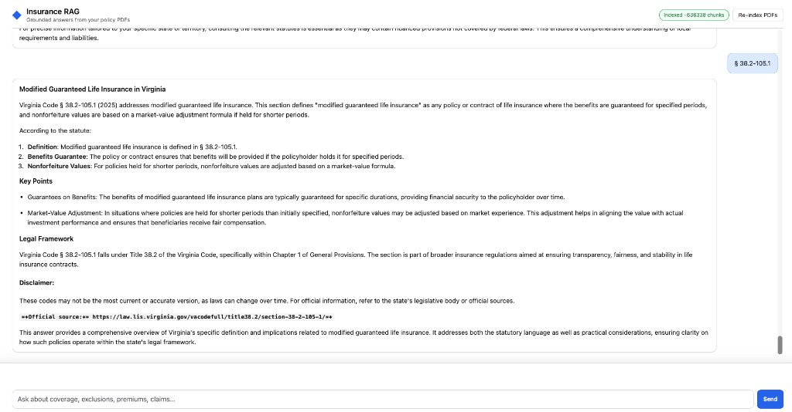

# Insurance RAG (Surplus lines & statutes)

[](https://github.com/hemanthsai126/RAG-for-Surplus-lines-tax)

Retrieval-augmented Q&A over **insurance PDFs**, **regulator materials**, and **state statute excerpts** (Markdown). The stack is **FastAPI** + a static chat UI, **hybrid retrieval** (BM25 + FAISS with RRF fusion), **cross-encoder reranking**, and answers streamed from **Ollama** or any **OpenAI-compatible** API.

This repo also ships the **P&C Copilot** backend from **`Zprojects`** (`app/copilot/`): NAICS lookup, XGBoost + SHAP risk scoring, policy TF-IDF extraction, quote-compare forwarding, PDF upload, and an optional **`POST /api/risko/chat`** endpoint (LLM-only, no vector index — same env pattern as Zprojects: `RISKO_LLM_BACKEND`, Ollama or OpenAI).

**Risko in the web UI** is the **document RAG** experience: one page uses **`POST /api/chat/stream`** (hybrid retrieve → rerank → stream). System prompt can include the Risko persona when **`USE_RISKO=true`** (default). The **`/api/risko/chat`** route remains for scripts or integrations that want chat **without** retrieval.

**`GET /api/health`** includes index fields plus **`persona`** / **`use_risko`** and a **`copilot`** map of the extra API routes.

**Interview / architecture deep dive:** For an end-to-end technical walk-through (ingest, hybrid RRF, reranking, prompts, Risko persona, Copilot, frontend, Docker/HF, trade-offs, and likely Q&A), see **`docs/INTERVIEW_PREP.md`**.

---

## UI examples

The chat UI shows **live index status** (chunk count), a **Re-index** control, and **streaming Markdown** answers. Below are three real interactions: two grounded in **Virginia insurance code** retrieval, and one that blends **indexed PDFs** with general reasoning for a hypothetical premium question.

### Virginia: adverse underwriting decisions

The user asks about **information concerning previous adverse underwriting decisions** in Virginia. The model returns a structured answer tied to **Code of Virginia Title 38.2**, highlighting **§ 38.2-611** (limitations on using prior adverse history) and **§ 38.2-610** (notice and reasons), with links to the official code. This illustrates **statute-centric RAG**: dense + lexical search over `ins_codes` markdown, then generation with citations drawn from chunk text.



### San Francisco: “least I’d pay per month” for a bay-area home

Here the question is intentionally **broad and hypothetical** (coverage mix, earthquake risk, deductibles). The reply outlines **coverage components**, **earthquake** cost drivers, and a **worked numeric example** (insured value, limit, deductible, PML-style factors). The header shows a **large chunk count** (hundreds of thousands of indexed passages), reflecting a full corpus plus PDFs. Use this as an example of **long-form, educational answers**; always validate numbers against your own policy and insurer.



### Virginia: Modified Guaranteed Life (§ 38.2-105.1)

The assistant answers on **Modified Guaranteed Life Insurance** under **Virginia Code § 38.2-105.1**, with sections on definitions, benefit guarantees, market-value adjustments, placement in Title 38.2, and a **disclaimer plus official source** link. The small **§ 38.2-105.1** tag in the thread mirrors how the UI surfaces statute-grounded replies.



---

## Features

- **Hybrid search** — lexical BM25 and dense embeddings (`sentence-transformers`), fused with reciprocal rank fusion (RRF).
- **Reranking** — `cross-encoder/ms-marco-MiniLM-L-6-v2` on fused candidates before generation.
- **Grounded answers** — retrieved passages carry statute **Source / Verify** metadata where present; the system prompt steers citation behavior.
- **Ingest** — recursive indexing of `.pdf`, `.md`, `.txt` under configurable roots; writes `chunks.json`, `faiss.index`, `bm25.pkl`, `embedder.txt` (default: `data/vectorstore/`).
- **UI** — dark-themed single page: health check, re-index, streaming chat with Markdown (Marked + DOMPurify).
- **P&C Copilot** — NAICS resolution, business risk + SHAP, coverage gaps vs uploaded policy text, optional quote API, optional **`/api/risko/chat`** (LLM-only), policy PDF text extraction (`app/copilot/`).

---

## Quick start (local)

```bash
git clone https://github.com/hemanthsai126/RAG-for-Surplus-lines-tax.git
cd RAG-for-Surplus-lines-tax
python3 -m venv .venv
source .venv/bin/activate   # Windows: .venv\Scripts\activate
pip install -r requirements.txt
```

Put content under `data/`, `webpage_pdfs/`, and/or **`ins_ipynb/data/`** (see [Data on disk](#data-on-disk)), or set **`PDFS_DIRS`** to a comma-separated list of roots.

```bash
python -m app.ingest          # build the index
uvicorn app.main:app --reload --host 127.0.0.1 --port 8001
```

Open **http://127.0.0.1:8001/** after `cd frontend && npm install && npm run build` (FastAPI then serves the **React** app at `/` and client routes such as `/risko`). For local development with hot reload, run the API on **8001** and in a second terminal:

```bash
cd frontend && npm install && npm run dev
```

Then open **http://127.0.0.1:5173** — Vite proxies `/api` to port **8001** (`VITE_API_PORT` in `frontend/.env`).

**Pages:** **Copilot** (`/`) — risk & policy analyze · **Compare quotes** · **Risko** (`/risko`) — indexed-document chat (re-index + `POST /api/chat/stream`) · **About**.

Legacy static files remain under **`/assets/`** (old single-page UI) if you still need them.

Use **Re-index** on the Risko page or `POST /api/ingest` after changing documents.

**LLM:** run [Ollama](https://ollama.com/) locally and align **`OLLAMA_MODEL`** with `ollama list`, **or** set **`OPENAI_BASE_URL`** and **`OPENAI_MODEL`** (and **`OPENAI_API_KEY`** if required) for a cloud / vLLM endpoint.

---

## Docker & Hugging Face Spaces

The repo includes a **`Dockerfile`**: installs dependencies, runs **`scripts/bootstrap_vectorstore.py`** (optional Hub download of the index), then **`uvicorn`** on **`0.0.0.0:${PORT}`** (default **7860**).

| Variable | Purpose |
|----------|---------|
| **`HF_VECTORSTORE_REPO`** | Dataset or model id on the Hub that holds `chunks.json`, `faiss.index`, `bm25.pkl`, `embedder.txt`. |
| **`HF_VECTORSTORE_REPO_TYPE`** | `dataset` (default) or `model`. |
| **`HF_VECTORSTORE_PATH_PREFIX`** | Subfolder inside the Hub repo, if files are not at the root. |
| **`HF_TOKEN`** / **`HUGGING_FACE_HUB_TOKEN`** | Read private Hub assets. |
| **`OPENAI_BASE_URL`**, **`OPENAI_MODEL`**, **`OPENAI_API_KEY`** | Typical cloud setup on Spaces (Ollama on your laptop is not reachable from HF). |
| **`VECTOR_DIR`** | Where artifacts are stored (default `data/vectorstore`). |

To **bake** the index into the image instead, copy `data/vectorstore/` into the build context and remove the `data/vectorstore` line from **`.dockerignore`**.

---

## Data on disk

The large multi-state statute tree **`ins_ipynb/data/`** is **not committed** to Git (size and push reliability). After clone, restore that folder yourself (copy from backup, zip, or Hugging Face dataset) or point **`PDFS_DIRS`** at another corpus path. See **`ins_ipynb/DATA.txt`**.

Generated index files live under **`data/vectorstore/`** and are **gitignored**; produce them with ingest or download them via **`HF_VECTORSTORE_REPO`** in Docker/Spaces.

---

## Configuration (high level)

| Variable | Role |
|----------|------|
| **`PDFS_DIRS`** | Comma-separated ingest roots (overrides defaults). |
| **`PDFS_DIR`** | Single root; ignored if `PDFS_DIRS` is set. |
| **`VECTOR_DIR`** | Vector artifact directory (`vector_dir` in code). |
| **`OLLAMA_BASE_URL`**, **`OLLAMA_MODEL`**, **`OLLAMA_TIMEOUT_S`** | Ollama defaults. |
| **`OPENAI_BASE_URL`**, **`OPENAI_MODEL`**, **`OPENAI_API_KEY`** | OpenAI-compatible chat when base URL and model are both set. |
| **`STRICT_DOMAIN_GUARD`** | If `true`, optional insurance-domain gate before retrieval. |
| **`USE_RISKO`** | If `true` (default), system prompt uses **Risko** + RAG rules; if `false`, legacy opener only. |
| **`RETRIEVAL_PATH_BONUS_SUBSTRINGS`**, **`RETRIEVAL_PATH_RRF_BONUS`** | Nudge retrieval toward paths containing substrings (e.g. `ins_codes`). |

Full semantics and defaults: **`app/config.py`**.

---

## HTTP API

### Insurance RAG

| Method | Path | Description |
|--------|------|-------------|
| GET | `/` | Web UI |
| GET | `/api/health` | Index status, chunk count, paths, `copilot` route map |
| POST | `/api/ingest` | Rebuild index from configured directories |
| POST | `/api/chat/stream` | SSE RAG chat: `{ "message", "history" }` |
| GET | `/api/context_preview?q=…` | Retrieval debug (no LLM) |

### P&C Copilot (Zprojects)

| Method | Path | Description |
|--------|------|-------------|
| GET | `/api/naics/lookup?code=` | NAICS → 2012 industry title |
| POST | `/api/analyze` | JSON body: business profile + optional policy text |
| POST | `/api/analyze-upload` | Multipart form + optional policy PDF |
| POST | `/api/quotes/compare` | Forward to `INSURANCE_QUOTES_API_URL` when set (else mock) |
| POST | `/api/upload-policy` | PDF → extracted text (max 15MB) |
| POST | `/api/risko/chat` | Optional LLM-only chat (no vector index); the **Risko** UI uses `/api/chat/stream` instead |

Copilot env vars match Zprojects (e.g. **`INSURANCE_QUOTES_API_URL`**, **`RISKO_LLM_BACKEND`**, **`OPENAI_CHAT_COMPLETIONS_URL`** for Risko’s OpenAI path). Risk model trains a cached **`risk_xgb.joblib`** under `app/copilot/data/` on first use if none exists.

---

## Development

```bash
pytest
SKIP_LLM=1 python -m app.eval.run_eval --benchmark benchmarks/qa_sample.json
```

---

