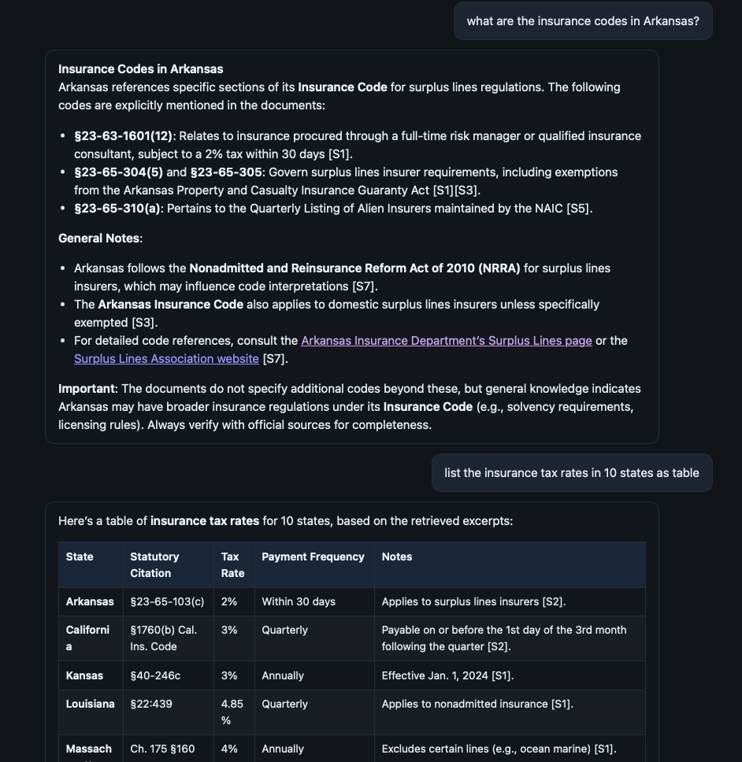

# Insurance RAG — low-level project guide



This repository is a **Retrieval-Augmented Generation (RAG)** web application focused on **insurance**: policies as PDFs, regulator reports, and **state insurance statutes** stored as Markdown. A **FastAPI** backend builds a **hybrid search index** (lexical + dense vectors), **reranks** candidate passages with a **cross-encoder**, then streams an answer from a **local LLM** (Ollama) or an **OpenAI-compatible** HTTP API. A small **static** single-page UI talks to the API over **Server-Sent Events (SSE)**.

The sections below describe **what each part of the code does**, **how data flows**, and **which files matter** when you change behavior.

---

## 1. Big picture: request path

```mermaid
flowchart LR
  subgraph browser
    UI[static HTML/JS]
  end
  subgraph api[FastAPI app.main]
    H[/api/health]
    I[/api/ingest]
    C[/api/chat/stream]
    P[/api/context_preview]
  end
  subgraph rag[app.rag.pipeline]
    R[hybrid_retrieve]
    RR[rerank]
    LLM[Ollama or OpenAI-compatible]
  end
  VS[(VectorStore\nchunks + BM25 + FAISS)]
  UI --> C
  C --> R --> VS
  R --> RR --> LLM
  I --> ingest[app.ingest]
  ingest --> VS
```

1. **Ingest** (manual or `POST /api/ingest`) walks configured directories, reads `.pdf` / `.md` / `.txt`, splits text into **chunks**, embeds each chunk with **Sentence-Transformers**, builds **BM25Okapi** and a **FAISS IndexFlatIP** index, and writes everything under `data/vectorstore/` (or `VECTOR_DIR` if you add it—currently the code uses `settings.vector_dir` from config; see §4).
2. **Chat** (`POST /api/chat/stream`) loads `VectorStore` (singleton in `main.py`), runs **retrieve → rerank**, builds a **user message** that embeds passage text, sends **system + optional history + user** to the LLM, and streams tokens back as SSE `data: {"token": "..."}` lines.

There is **no** database server: the “vector database” is **files on disk** under **`vector_dir`** (default `data/vectorstore/`): `chunks.json`, `faiss.index`, `bm25.pkl`, `embedder.txt`.

---

## 2. Repository layout (what lives where)

| Path | Role |
|------|------|
| `app/__init__.py` | Package marker. |
| `app/main.py` | **FastAPI app**: lifespan loads index, routes for health, ingest, streaming chat, optional `GET /api/context_preview`, static mount, `/` serves `static/index.html`. |
| `app/config.py` | **Pydantic `BaseSettings`**: paths, model names, retrieval hyperparameters, `.env` loading. Single global `settings`. |
| `app/ingest.py` | **Indexing pipeline**: PDF text extraction, sliding-window chunking, statute-MD header duplication, embedding, `VectorStore.save()`. Runnable as `python -m app.ingest`. |
| `app/store.py` | **`VectorStore`**: load/save artifacts, `embed_query`, `build_store_from_chunks`, **BM25 tokenization** (`tokenize_bm25`). |
| `app/retrieval/hybrid.py` | **BM25 top-k**, **FAISS top-k**, **RRF fusion**, optional **path substring bonus** for `ins_codes` (etc.). |
| `app/retrieval/reranker.py` | **CrossEncoder** rerank (`lru_cache` on model load). |
| `app/rag/prompts.py` | **`SYSTEM_INSURANCE_RAG`** and **`build_user_message()`** — jurisdiction rules, statute URL rules, length/clarity. |
| `app/rag/pipeline.py` | **`retrieve_and_pack_context`**, **`stream_answer`**, **`stream_ollama`**, **`stream_openai_compatible`**, **`collect_answer`**. |
| `app/guards/domain.py` | **`is_insurance_domain()`** — keyword / citation / regex heuristics; used only if `STRICT_DOMAIN_GUARD` is true. |
| `app/eval/run_eval.py` | CLI benchmark: retrieval substring checks, optional full LLM answers; `SKIP_LLM=1` skips generation. |
| `static/` | **UI**: `index.html`, `style.css`, `app.js` (fetch + SSE + Marked + DOMPurify). |
| `data/vectorstore/` | **Generated index** (after ingest): `chunks.json`, `faiss.index`, `bm25.pkl`, `embedder.txt`. |
| `data/` | Default **content root** for PDFs/Markdown not under other roots; may also hold other assets. |
| `webpage_pdfs/` | Optional second default root for crawled/saved PDFs. |
| `ins_ipynb/data/` | Large tree of **`…/<state>/ins_codes/*.md`** statute excerpts (and similar); third default ingest root when the folder exists. |
| `benchmarks/qa_sample.json` | Sample eval cases for `run_eval`. |
| `tests/` | `pytest` tests (RRF, domain guard). |
| `requirements.txt` | Pip dependencies (FastAPI, FAISS, sentence-transformers, rank-bm25, httpx, PDF libs, pytest, ruff). |

---

## 3. Configuration (`app/config.py`) in detail

Settings load from **environment variables** and optional **`.env`** (`SettingsConfigDict(env_file=".env")`). Field names in code vs env:

| Env / concern | Code field | Meaning |
|---------------|------------|---------|
| `PDFS_DIRS` | `pdfs_dirs_csv` | Comma-separated list of **directory roots** to crawl for `*.pdf`, `*.md`, `*.txt` (recursive). |
| `PDFS_DIR` | `pdfs_dir_env` | Single root; **ignored** if `PDFS_DIRS` is non-empty. |
| *(unset)* | `pdfs_dirs` (computed) | **`_default_pdfs_dirs()`**: each of `webpage_pdfs/`, `data/`, `ins_ipynb/data/` **if that path exists as a directory**; if none exist, falls back to `[data/]` only. |
| `DATA_DIR` | `data_dir` | Default project `data/` (parent of default vectorstore path is derived from repo root). |
| `VECTOR_DIR` (typical env form for `vector_dir`) | `vector_dir` | Default **`data/vectorstore`** — where FAISS/BM25/chunks live. |
| — | `embedding_model` | Default `sentence-transformers/all-MiniLM-L6-v2` — **bi-encoder** for chunk and query vectors; override in code unless you add an env alias. |
| — | `cross_encoder_model` | Default `cross-encoder/ms-marco-MiniLM-L-6-v2` — **reranker**. |
| — | `chunk_size` / `chunk_overlap` | Sliding window chunk length and step-back overlap (characters). |
| — | `bm25_top_k` / `faiss_top_k` | How many doc indices each leg returns before fusion. |
| — | `rrf_k` | RRF constant **k** in `1/(k + rank + 1)`. |
| — | `fuse_top_n` | Cap on fused candidate list size passed to reranker. |
| — | `rerank_top_k` | How many chunks after rerank are concatenated into the LLM context. |
| `RETRIEVAL_PATH_BONUS_SUBSTRINGS` | `retrieval_path_bonus_substrings` | Comma-separated substrings; if chunk `source` path contains any (case-insensitive), RRF score gets additive bonus. |
| `RETRIEVAL_PATH_RRF_BONUS` | `retrieval_path_rrf_bonus` | Default `0.12` — nudge toward `ins_codes` paths. |
| `OLLAMA_BASE_URL` / `OLLAMA_MODEL` / `OLLAMA_TIMEOUT_S` | `ollama_*` | Local Ollama chat defaults. |
| `OPENAI_BASE_URL` + `OPENAI_MODEL` | optional | If **both** set, **`stream_answer`** uses OpenAI-style streaming instead of Ollama. |
| `OPENAI_API_KEY` | optional | Bearer token for compatible servers. |
| `STRICT_DOMAIN_GUARD` | `strict_domain_guard` | If true, queries failing `is_insurance_domain` get a canned rejection **without** retrieval. |

**Important:** Changing `chunk_size`, `tokenize_bm25`, or ingest logic requires **re-running ingest** so `chunks.json` and `bm25.pkl` stay consistent with embeddings.

---

## 4. Ingest pipeline (`app/ingest.py`) — step by step

### 4.1 File discovery

- `ingest_pdfs()` takes optional `pdf_dirs`; otherwise **`settings.pdfs_dirs`**.
- Every root must exist as a directory or **`FileNotFoundError`**.
- For each root, **`rglob`** collects `*.pdf`, `*.md`, `*.txt` (three passes, deduped by resolved path).
- Files are sorted by POSIX path for stable chunk IDs across runs (given same content).

### 4.2 Per-file text extraction

- **PDF:** `pdfplumber` per page; if extraction fails or is empty, **`pypdf`** fallback. PDFMiner warnings are suppressed during extraction.
- **`.md` / `.txt`:** UTF-8 read with `errors="replace"`.

### 4.3 Source path (`chunk["source"]`)

- Prefer path **relative to project root** (`settings.data_dir.parent`, i.e. repo root).
- If the file is outside that tree, fall back to `root.name/relative_to(root)` or `fp.name`.

This string is what hybrid retrieval uses for **path bonus** (e.g. substring `ins_codes`).

### 4.4 Chunking (`chunk_text`)

- Character window: **`[start, end)`** with `end = min(start + chunk_size, len(text))`.
- Non-empty `piece.strip()` becomes a chunk.
- **`start_char`** records the window start in the original file (useful for debugging; not sent to the LLM in current pipeline).
- **`id`:** first 16 hex chars of `SHA256(f"{source}:{idx}:{piece[:64]}")`.

### 4.5 Statute Markdown special case (`ins_codes/*.md`)

Statute files have a **YAML-like header**: title, **Source (Justia…)** URL, **Verify** link, then `---`. Plain chunking would put that header only in the **first** chunk; later chunks would lack URLs, so the model could not cite them.

- **`_statute_front_matter`:** Takes text from the start through the first standalone `---` block (several newline variants).
- **`_chunk_has_statute_links`:** Heuristic on first 5000 chars for `justia.com`, `revisor…`, `legislature.`.
- For paths matching **`_is_statute_md_path`** (`ins_codes` in path), any chunk **without** those links gets **`front_matter + "\n\n" + text`** and a **recomputed `id`**.

### 4.6 Embedding and persistence

- One **`SentenceTransformer(settings.embedding_model)`** encodes all chunk texts in batches (with progress callback for CLI ingest).
- **`build_store_from_chunks`** (in `store.py`) builds BM25 + FAISS and returns **`VectorStore`**.
- **`store.save(vector_dir)`** writes four files (see §5).

---

## 5. The vector store (`app/store.py`)

### 5.1 Chunk JSON shape

Each element of **`chunks.json`** is an object, minimally:

```json
{
  "id": "hex16",
  "text": "passage text shown to the LLM",
  "source": "relative/path/to/file.md",
  "start_char": 0
}
```

(Fields may be extended in the future; the loader keeps unknown keys.)

### 5.2 BM25 (`bm25.pkl`)

- **`rank_bm25.BM25Okapi`** over **token lists** produced by **`tokenize_bm25(text)`**.
- Tokens are lowercase **`[a-z0-9]+`** words **plus** hyphen-connected digit/letter chains (for statute citations like `40-2-124`).
- Kansas-style `40-2,124` is normalized to extra hyphen groups before chain extraction.

### 5.3 FAISS (`faiss.index`)

- **`faiss.IndexFlatIP`** on **L2-normalized** float32 vectors (inner product = cosine similarity for normalized vectors).
- Query vectors are built the same way in **`VectorStore.embed_query`**.

### 5.4 Embedder fingerprint (`embedder.txt`)

- Single line: model id used at index time. **`VectorStore.load`** instantiates the same **`SentenceTransformer`** so query vectors match the index dimension.

**Load failure:** If any of the four files is missing, **`VectorStore.load()` returns `None`**, and the API reports “no index” until ingest completes.

---

## 6. Retrieval (`app/retrieval/hybrid.py`)

1. **BM25 leg:** `tokenize_bm25(query)` → `get_scores` → top **`bm25_top_k`** chunk indices.
2. **Dense leg:** embed query → `faiss_index.search` → top **`faiss_top_k`** indices (invalid ids filtered).
3. **RRF:** For each list, each document at zero-based rank `r` contributes **`1 / (rrf_k + r + 1)`** to that doc’s fused score; lists are summed; sort descending.
4. **Path bonus:** Optional additive constant to fused score if `source` contains configured substrings; re-sort; then **truncate to `fuse_top_n`**.

No query-time metadata filter: **every chunk in the index** is eligible unless you rebuild a smaller index or change code.

---

## 7. Reranking (`app/retrieval/reranker.py`)

- **`CrossEncoder(settings.cross_encoder_model)`** is cached with **`lru_cache(maxsize=2)`**.
- Pairs **`[query, chunk_text]`** for each fused candidate text (not paths).
- Returns **`rerank_top_k`** pairs `(position_in_candidate_list, score)` sorted by score.
- **`retrieve_and_pack_context`** maps positions back to **global chunk indices** and builds **`blocks`** as **plain `chunk["text"]` only** (no `[S1]` tags, no filenames) for the LLM.

---

## 8. Generation (`app/rag/pipeline.py` + `prompts.py`)

### 8.1 Messages assembled

1. System: **`SYSTEM_INSURANCE_RAG`** (long instruction block: jurisdiction, statute layout, URLs, length, style).
2. Up to **last 6** turns from `history` with roles **`user` / `assistant`** (non-empty `content` only).
3. User: **`build_user_message(query, blocks)`** — joins blocks with `\n\n---\n\n`, prepends instructions to copy **Source/Verify** lines when using statute text.

### 8.2 Domain guard

- If **`strict_domain_guard`** and **`not is_insurance_domain(query)`**, yields **`domain_rejection_message()`** and **returns without retrieval**.

### 8.3 Backend selection

- If **`openai_base_url` and `openai_model`** are both set → **`stream_openai_compatible`** (OpenAI-style SSE `data: {...}` deltas).
- Else → **`stream_ollama`** (`POST …/api/chat`, JSON lines with `message.content`).

Errors from Ollama (connection, 404 model) are translated into **streamed troubleshooting text** for the user.

---

## 9. HTTP API (`app/main.py`)

| Method | Path | Behavior |
|--------|------|----------|
| GET | `/` | **`FileResponse(static/index.html)`** if present; else JSON hint. |
| GET | `/api/health` | `ok`, whether index loaded, **chunk count**, **`pdfs_dirs`**, **`vector_dir`**, **`ollama_model`**. |
| POST | `/api/ingest` | Runs **`ingest_pdfs()`**, **`reload_store()`**, returns ingest summary JSON. |
| POST | `/api/chat/stream` | Body **`{ "message": string, "history": [{role, content}, …] }`**. Returns **`text/event-stream`**: `data: {"token":"..."}` and final `data: {"done": true}`. |
| GET | `/api/context_preview?q=…` | Debug: returns **`retrieve_and_pack_context`** metadata + count (no LLM). |
| GET | `/assets/*` | Static files from **`static/`** if directory exists (CSS/JS). |

CORS is **permissive** (`allow_origins=["*"]`) for local dev.

---

## 10. Frontend (`static/`)

- **`index.html`**: layout, loads **Marked** and **DOMPurify** from jsDelivr, loads **`/assets/app.js`** as a module.
- **`app.js`**: polls **`/api/health`**, **Re-index** button → `POST /api/ingest`, chat → **`POST /api/chat/stream`** with **`ReadableStream`** parsing of SSE lines, maintains **`history`** array for multi-turn (last user message duplicated in payload shape—see code), renders assistant Markdown safely.

---

## 11. Evaluation (`app/eval/run_eval.py`)

- Loads **`VectorStore`** from **`settings.vector_dir`**.
- For each benchmark row: optional **`retrieval_must_contain`** strings checked against **joined retrieved chunk text** (lowercased).
- Unless **`SKIP_LLM`** is truthy: runs **`collect_answer`** (full async pipeline including LLM), scores length and optional **`answer_must_mention`** keywords.
- Prints one JSON summary to stdout.

---

## 12. Tests (`tests/`)

- **`test_hybrid.py`:** sanity check that **RRF** ranks a document appearing in **both** rank lists highly.
- **`test_domain.py`:** domain guard behavior (see file for assertions).

Run: **`pytest`** from repo root (with venv activated).

---

## 13. Quick start (operations)

```bash
cd /path/to/RAG
python3 -m venv .venv
.venv/bin/python3 -m pip install -r requirements.txt
```

On macOS, prefer **`.venv/bin/python3`** explicitly so you do not accidentally use **Apple’s Xcode Python** without your packages.

**Build index:**

```bash
.venv/bin/python3 -m app.ingest
# or start the server and use the UI “Re-index PDFs” or POST /api/ingest
```

**Run API:**

```bash
.venv/bin/python3 -m uvicorn app.main:app --reload --host 127.0.0.1 --port 8001
```

Open **http://127.0.0.1:8001/** , ensure **Ollama** is running (`ollama serve`) and **`ollama pull`** your **`OLLAMA_MODEL`**, then chat.

---

## 14. Design limitations (honest)

- **Chunking is naive** (fixed character windows): tables and sections may be split mid-row; statute **semantics** are not paragraph-aware.
- **No citation provenance in the UI**: chunk `source` paths are intentionally **not** injected into the model prompt as filenames (to reduce prompt leakage); answers rely on the model following **Source/Verify** lines inside chunk text.
- **Retrieval is global** to the index: a large mix of states and PDFs can surface **jurisdictionally irrelevant** passages; prompts try to mitigate **California defaulting** and **unnamed-state** overfitting, but retrieval tuning is still the user’s lever (`PDFS_DIRS`, bonuses, or future code filters).
- **Scanned PDFs** without OCR yield **empty text** and no useful chunks.

---

## 15. License

Use and modify for your own deployment; add a license file if you redistribute.
