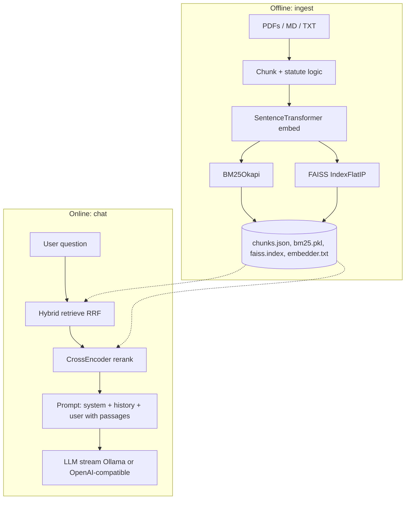

# Insurance RAG — complete technical & interview guide

This document is a **deep, end-to-end explanation** of the repository: architecture, algorithms, configuration, trade-offs, and **how to talk about the project** in a short interview (e.g. 30 minutes with a CEO or hiring team). It complements the shorter `README.md`.

**How to use this in 30 minutes**

| Time | Focus |
|------|--------|
| 0–3 min | **Problem + outcome**: domain-specific Q&A over large insurance corpora (PDFs + state statute markdown), grounded answers, streaming UX. |
| 3–10 min | **Architecture**: ingest → files on disk (no DB) → hybrid retrieve → rerank → LLM stream; mention FastAPI + optional React SPA + Docker/HF. |
| 10–20 min | **Differentiators**: hybrid RRF + path nudge for `ins_codes`, statute header duplication, BM25 tokenization for citations, prompt rules for jurisdiction + official URLs. |
| 20–28 min | **Honest limits**: chunking is character-based; no per-UI source chips; scale/RAM for torch + index; copilot is a separate underwriting demo. |
| 28–30 min | **Your role**: what you built, extended, or would improve next (tests, filters, LFS, eval harness). |

---

## Table of contents

1. [Executive summary](#1-executive-summary)  
2. [Business framing](#2-business-framing)  
3. [High-level architecture](#3-high-level-architecture)  
4. [Repository layout](#4-repository-layout)  
5. [Configuration (`app/config.py`)](#5-configuration-appconfigpy)  
6. [Ingest pipeline (`app/ingest.py`)](#6-ingest-pipeline-appingestpy)  
7. [Vector store (`app/store.py`)](#7-vector-store-appstorepy)  
8. [Hybrid retrieval (`app/retrieval/hybrid.py`)](#8-hybrid-retrieval-appretrievalhybridpy)  
9. [Reranking (`app/retrieval/reranker.py`)](#9-reranking-appretrievalrerankerpy)  
10. [RAG pipeline & LLM (`app/rag/pipeline.py`)](#10-rag-pipeline--llm-appragpipelinepy)  
11. [Prompts (`app/rag/prompts.py`)](#11-prompts-appragpromptspy)  
12. [Risko persona (`app/rag/risko.py`)](#12-risko-persona-appragriskopy)  
13. [Domain guard (`app/guards/domain.py`)](#13-domain-guard-appguardsdomainpy)  
14. [HTTP API (`app/main.py`)](#14-http-api-appmainpy)  
15. [P&C Copilot (`app/copilot/`)](#15-pc-copilot-appcopilot)  
16. [Frontend (`frontend/`)](#16-frontend-frontend)  
17. [Deployment: Docker & Hugging Face](#17-deployment-docker--hugging-face)  
18. [Bootstrap script (`scripts/bootstrap_vectorstore.py`)](#18-bootstrap-script-scriptsbootstrap_vectorstorepy)  
19. [Testing & CI](#19-testing--ci)  
20. [Trade-offs and limitations](#20-trade-offs-and-limitations)  
21. [Likely interview questions](#21-likely-interview-questions)  
22. [Glossary](#22-glossary)

---

## 1. Executive summary

**What the system does:** It answers **insurance-related questions** using **your own documents**—PDFs, markdown (including multi-state **insurance code** extracts), and plain text—combined with optional **general insurance knowledge** from the LLM. There is **no traditional database**: the “knowledge base” is **four files on disk** under `data/vectorstore/` (by default): chunk metadata + text, a FAISS index, a BM25 index, and an embedder fingerprint.

**Core technical story:**  
1. **Offline indexing (ingest)** walks configured directories, extracts text, **chunks** with overlap, optionally **prepends statute front-matter** so every chunk has URLs, **embeds** all chunks with **Sentence-Transformers**, builds **BM25Okapi** over a custom tokenizer and **FAISS IndexFlatIP** over L2-normalized vectors, then **persists** everything.  
2. **Online Q&A** runs **BM25 top-k** and **FAISS top-k**, **fuses** ranks with **reciprocal rank fusion (RRF)**, optionally **boosts** chunks whose file path contains `ins_codes`, **reranks** the fused list with a **cross-encoder**, packs plain chunk text into a **single user message**, and **streams** tokens from **Ollama** or an **OpenAI-compatible** HTTP API.

**Why it’s credible for an enterprise conversation:** Clear separation of concerns, standard RAG pattern, explicit prompt contracts for **jurisdiction** and **citations**, hybrid retrieval (not “vectors only”), explainable knobs (env + `config.py`), and a path to **cloud deploy** (Docker + optional Hub download of the index).

---

## 2. Business framing

**Stakeholder pain:** Insurance teams drown in **PDFs**, **regulatory filings**, and **statute text**. Keyword search misses paraphrases; pure semantic search misses exact statutory citations and rare tokens.

**Product angle:** A **single web experience** (or API) that feels like “ChatGPT over *our* documents,” with answers that **respect** retrieved text (especially for statutes) and **surface official links** when present in the corpus.

**Scope boundary:** The app is **educational / demo-grade** unless you harden auth, tenancy, eval gates, and compliance. The **P&C Copilot** (`app/copilot/`) is an additional **underwriting-style demo** (risk score, SHAP, gaps)—useful to show breadth, but separate from the FAISS/BM25 RAG path.

---

## 3. High-level architecture

### 3.1 Data flow (conceptual)

### 3.2 Runtime components

| Layer | Technology | Role |
|-------|------------|------|
| API | **FastAPI** | REST + **SSE** streaming for chat; CORS open for local dev |
| Config | **Pydantic Settings** | `.env` + env vars → typed `settings` |
| Embeddings | **sentence-transformers** | `all-MiniLM-L6-v2` default; normalized vectors for cosine via inner product |
| Lexical | **rank-bm25** | `BM25Okapi` over per-chunk token lists |
| Vector | **faiss-cpu** | `IndexFlatIP` + normalized vectors |
| Rerank | **CrossEncoder** | `ms-marco-MiniLM-L-6-v2` default |
| LLM | **httpx** async | Ollama `/api/chat` or OpenAI-style `/chat/completions` streaming |
| UI | **Static HTML/JS** or **React SPA** | Same APIs; SPA built with Vite |

---

## 4. Repository layout

| Path | Purpose |
|------|---------|
| `app/main.py` | FastAPI app: lifespan loads index, core routes, static + SPA serving |
| `app/config.py` | All tunable defaults + env aliases |
| `app/ingest.py` | File discovery, PDF extraction, chunking, statute handling, calls `build_store_from_chunks` |
| `app/store.py` | `VectorStore`, `tokenize_bm25`, load/save, `embed_query` |
| `app/retrieval/hybrid.py` | BM25 + FAISS + RRF + optional path bonus |
| `app/retrieval/reranker.py` | CrossEncoder rerank |
| `app/rag/pipeline.py` | `retrieve_and_pack_context`, `stream_answer`, Ollama/OpenAI stream parsers |
| `app/rag/prompts.py` | Long system prompt + `build_user_message` |
| `app/rag/risko.py` | Composes **Risko** identity + RAG rules → `SYSTEM_RISKO_RAG` |
| `app/guards/domain.py` | Optional keyword-style domain gate |
| `app/copilot/` | Ported Zprojects: analyze, NAICS, quotes, `risko_llm` API, etc. |
| `static/` | Legacy single-page UI (`index.html`, `app.js`, `style.css`) |
| `frontend/` | React multi-page app (Vite + Tailwind) |
| `scripts/bootstrap_vectorstore.py` | Optional HF Hub download of index before `uvicorn` |
| `Dockerfile` | Production container: bootstrap + uvicorn |
| `tests/` | Unit tests for RRF and domain guard |
| `docs/` | Screenshots, this interview guide |

---

## 5. Configuration (`app/config.py`)

**Design choice:** One `Settings` object (`settings = Settings()`) is imported everywhere. **Pydantic v2** validates types; **`pydantic-settings`** loads `.env` and process environment.

**Notable fields:**

| Concept | Field / env | What it controls |
|---------|-------------|------------------|
| Ingest roots | `PDFS_DIRS` → `pdfs_dirs_csv` | Comma-separated list; overrides defaults |
| Single root | `PDFS_DIR` → `pdfs_dir_env` | Used only if `PDFS_DIRS` empty |
| Default roots | `_default_pdfs_dirs()` | `webpage_pdfs/`, `data/`, `ins_ipynb/data/` if each exists as a directory |
| Index directory | `vector_dir` | Default `data/vectorstore` |
| Bi-encoder | `embedding_model` | Default `sentence-transformers/all-MiniLM-L6-v2` |
| Cross-encoder | `cross_encoder_model` | Default `cross-encoder/ms-marco-MiniLM-L-6-v2` |
| Chunking | `chunk_size`, `chunk_overlap` | Character windows (not token windows) |
| Retrieval width | `bm25_top_k`, `faiss_top_k` | How many hits each leg returns before fusion |
| RRF constant | `rrf_k` | Passed into `1/(k+rank+1)` |
| Fusion cap | `fuse_top_n` | Max candidates after fusion before reranking |
| Rerank depth | `rerank_top_k` | How many passages become LLM context |
| Path nudge | `RETRIEVAL_PATH_BONUS_SUBSTRINGS`, `RETRIEVAL_PATH_RRF_BONUS` | Additive score if chunk `source` path contains substring (default boosts `ins_codes`) |
| Ollama | `OLLAMA_*` | Base URL, model name, timeout |
| OpenAI-compatible | `OPENAI_BASE_URL`, `OPENAI_MODEL`, `OPENAI_API_KEY` | If base URL **and** model set, chat uses this path instead of Ollama |
| Domain gate | `STRICT_DOMAIN_GUARD` | If true, non-insurance-y queries get canned reply **before** retrieval |
| Risko system | `USE_RISKO` → `use_risko_persona` | Default **true**: use `SYSTEM_RISKO_RAG` instead of legacy opener-only system string |

**Interview line:** “We centralized configuration in Pydantic Settings so ops can tune retrieval and models without code changes, and we documented the env surface for Docker and Hugging Face Spaces.”

---

## 6. Ingest pipeline (`app/ingest.py`)

### 6.1 Goals

- **Discover** all `*.pdf`, `*.md`, `*.txt` under each configured root (recursive, deduped by resolved path, stable sort by path for reproducible chunk IDs).
- **Extract** text: PDFs via **pdfplumber** first, **pypdf** fallback; suppress noisy pdfminer warnings during extraction.
- **Chunk** with sliding windows: `chunk_size` characters, step `chunk_size - chunk_overlap` so context carries across boundaries.
- **Stable chunk IDs:** `SHA256(f"{source}:{idx}:{piece[:64]}")` first 16 hex chars—so re-ingesting the same content yields the same id (given same ordering).

### 6.2 Statute markdown (`ins_codes`)

**Problem:** Statute files often have a **YAML-like header** (title, **Source**, **Verify**, Justia links) then `---`. If you only chunk naively, **only the first chunk** contains URLs; later chunks look “sourceless” to the model.

**Solution (high level):** For paths matching `_is_statute_md_path` (contains `/ins_codes/`), if a chunk body does **not** already contain link heuristics (`_chunk_has_statute_links`), **prepend** the captured front matter (`_statute_front_matter`) to the chunk text and **re-hash** the chunk id.

**Interview line:** “We invested in domain-specific ingest because insurance statutes without URLs in every chunk would break grounded answers; we duplicate front matter into later windows so the LLM always sees citation anchors.”

### 6.3 Building the store

After all chunks are collected, ingest uses **`SentenceTransformer(settings.embedding_model)`** and **`build_store_from_chunks`** (`store.py`): BM25 token lists, batched embedding (optional progress callback for CLI), FAISS build, then **`VectorStore.save(settings.vector_dir)`**.

---

## 7. Vector store (`app/store.py`)

### 7.1 `tokenize_bm25`

**Why custom?** Statute citations look like `40-2-124`. Naive `[a-z0-9]+` splits into `40`, `2`, `124`—BM25 loses the **compound citation** as a signal.

**What we do:** Lowercase text; normalize Kansas-style `40-2,124` to extra hyphens; collect normal word tokens **plus** regex chains `(?:\d+[a-z]?)(?:-\d+[a-z]?)+` for hyphen-linked groups.

**Operational note:** If you change tokenization, you **must re-ingest** so `bm25.pkl` matches.

### 7.2 FAISS index

- **`IndexFlatIP`** (inner product) on **L2-normalized** float32 vectors → inner product equals **cosine similarity** for normalized vectors.
- **Query side:** `embed_query` encodes the question with the **same** `SentenceTransformer` loaded from `embedder.txt` so dimensions and training distribution match.

### 7.3 Persistence

| File | Content |
|------|---------|
| `chunks.json` | List of dicts: at least `id`, `text`, `source`, `start_char` |
| `bm25.pkl` | Pickled `BM25Okapi` |
| `faiss.index` | Serialized FAISS index |
| `embedder.txt` | Single line: model id used at index time |

**`VectorStore.load`:** Returns `None` if any file missing → API reports “no index” until ingest.

---

## 8. Hybrid retrieval (`app/retrieval/hybrid.py`)

### 8.1 Two retrieval legs

1. **BM25:** `tokenize_bm25(query)` → `get_scores` → top `bm25_top_k` chunk indices (argsort descending).
2. **FAISS:** `embed_query` → `index.search` → top `faiss_top_k` indices (filter invalid `-1`).

### 8.2 Reciprocal Rank Fusion (RRF)

For each ranked list, document at **zero-based rank** `r` contributes **`1 / (k + r + 1)`** to that document’s fused score, where **`k`** defaults to `settings.rrf_k` (often 60). Scores from BM25 and FAISS lists **sum** for the same chunk id. Sort by fused score descending, then take **`fuse_top_n`**.

**Why RRF?** It avoids calibrating BM25 scores vs cosine scores; it’s robust when one modality is noisy.

### 8.3 Path substring bonus

After fusion, if `RETRIEVAL_PATH_BONUS_SUBSTRINGS` is non-empty, add **`RETRIEVAL_PATH_RRF_BONUS`** (default `0.12`) to fused score when chunk `source` path (normalized slashes, lowercased) contains any hint substring. Re-sort and truncate to `fuse_top_n`.

**Interview line:** “We bias retrieval toward statute paths because user questions often map to codified rules; the bonus is small so it’s a nudge, not a hard filter.”

---

## 9. Reranking (`app/retrieval/reranker.py`)

**CrossEncoder** scores **(query, passage)** pairs—more accurate than bi-encoder dot product for **semantic relevance**, but heavier (so we only run it on the fused shortlist).

**Caching:** `@lru_cache(maxsize=2)` on `get_cross_encoder()` so the model loads once per process.

**Output:** List of `(position_in_fused_list, score)` sorted descending, truncated to **`rerank_top_k`**.

---

## 10. RAG pipeline & LLM (`app/rag/pipeline.py`)

### 10.1 `retrieve_and_pack_context`

1. `hybrid_retrieve` → list of `(chunk_index, fused_score)`.
2. Map indices to **text strings** for reranking.
3. `rerank` returns positions in that candidate list.
4. Build **`blocks`**: plain `chunk["text"]` only—**no** `[S1]` tags, **no** filenames in the LLM prompt (reduces prompt injection / “fake source” behavior).

### 10.2 `build_user_message` (`prompts.py`)

- If **no** blocks: instruct model to answer from general insurance knowledge and relate to insurance; still no internal filenames.
- If blocks: join with `\n\n---\n\n`, add instructions about jurisdiction, URLs, length.

### 10.3 `stream_answer`

1. Optional **domain guard**: if `STRICT_DOMAIN_GUARD` and `not is_insurance_domain(query)` → yield rejection string and return.
2. Retrieve + pack.
3. Choose system string: **`SYSTEM_RISKO_RAG`** if `use_risko_persona` else **`SYSTEM_INSURANCE_RAG`**.
4. Assemble `messages`: `system`, up to **last 6** `user`/`assistant` history turns (non-empty), then final `user` with the big block + question.
5. Branch: if **`openai_base_url` and `openai_model`** both set → **`stream_openai_compatible`**; else **`stream_ollama`**.

### 10.4 Ollama streaming

- **POST** `{ollama_base}/api/chat` with `stream: true`.
- Read **JSON lines**; each line may contain `message.content` deltas; stop when `done`.
- **404 handling:** user-friendly hints (`ollama pull`, server down).

### 10.5 OpenAI-compatible streaming

- **POST** `{base}/chat/completions` with `stream: true`.
- Parse **SSE** lines `data: {...}` until `[DONE]`.
- Accumulate `choices[0].delta.content`.

### 10.6 API wrapper (`main.py` → `chat_stream`)

Wraps async generator as **SSE**: each chunk is `data: {"token": "..."}\n\n`, then `data: {"done": true}\n\n`, or `data: {"error": "..."}\n\n`.

**Interview line:** “We used SSE instead of WebSockets because it’s one-way, simple for browsers, and works well through proxies.”

---

## 11. Prompts (`app/rag/prompts.py`)

The system prompt is long on purpose—it encodes **product requirements**:

- **Jurisdiction discipline:** don’t treat California as default; if user didn’t name a state, don’t anchor the whole answer in one state’s code.
- **Statute layout literacy:** `(a)/(b)` and `(1)(2)` navigation.
- **Verbatim vs explain** modes.
- **Default long answers** unless user asks for TL;DR.
- **Mandatory official URLs** when statute content is used—final `**Official source:**` lines with verbatim URLs from excerpts.
- **No internal leakage:** no `[S1]`, no “provided passages,” no index filenames unless user asks.

**Why this matters in interview:** RAG demos often fail because prompts don’t constrain **hallucinated citations** or **wrong state**. This project encodes compliance-style behavior in the **system** layer.

---

## 12. Risko persona (`app/rag/risko.py`)

**`RISKO_IDENTITY`:** Ported conceptually from a separate “insurance-only assistant” product—scope (P&C, life, health, surplus lines, etc.), out-of-scope decline, safety disclaimer (“not personalized advice”), Markdown formatting expectations.

**`SYSTEM_RISKO_RAG`:** Risko identity + bridge paragraph (“retrieval-augmented mode”) + body of `SYSTEM_INSURANCE_RAG` with the generic opener line stripped to avoid duplicate “you are…” instructions.

**`USE_RISKO`:** Env toggles back to legacy opener-only system string if needed.

**Interview line:** “We unified branding: the UI ‘Risko’ page uses the same RAG API, while the optional `/api/risko/chat` remains for LLM-only demos or scripts.”

---

## 13. Domain guard (`app/guards/domain.py`)

If enabled, **`is_insurance_domain`** uses keywords, patterns (e.g. section symbols), and light heuristics to decide if the query is plausibly insurance-related. If not, **`domain_rejection_message()`** is returned **without** hitting the index (saves compute and reduces off-topic answers).

Default in config is **false**—so out-of-the-box behavior is permissive.

---

## 14. HTTP API (`app/main.py`)

| Route | Purpose |
|-------|---------|
| `GET /` | Serves `frontend/dist/index.html` if built, else `static/index.html`, else JSON hint |
| `GET /{path}` | SPA fallback for client-side routes when SPA exists |
| `GET /api/health` | Index status, dirs, model, `persona`/`use_risko`, `copilot` route map |
| `POST /api/ingest` | Full re-ingest + `reload_store()` |
| `POST /api/chat/stream` | SSE RAG chat |
| `GET /api/context_preview` | Debug retrieval without LLM |

**Static mounts:** `/assets` → legacy static dir; `/spa-assets` → Vite build assets (custom `assetsDir` avoids collision).

**Lifespan:** `get_store()` on startup attempts load; may be `None` until first ingest.

---

## 15. P&C Copilot (`app/copilot/`)

A **second product surface** in the same FastAPI process:

- **Risk / SHAP** stack (XGBoost, optional training CSV in `app/copilot/data/`).
- **Policy TF-IDF** “mini RAG” for extraction snippets vs business profile gaps.
- **NAICS** lookup from bundled Census-style CSV.
- **Quote compare** forwarder with mock mode if no partner URL.
- **`POST /api/risko/chat`** — LLM-only path using **`risko_llm.py`** (separate from the main RAG stream).

**Imports:** All internal imports use `app.copilot.*`; data paths point to `app/copilot/data/`.

**Interview framing:** “Same repo demonstrates both **document-grounded RAG** and a **structured underwriting narrative**—useful for a full-stack portfolio story.”

---

## 16. Frontend (`frontend/`)

- **Vite + React 19 + React Router + Tailwind v4.**
- **Dev:** `npm run dev` on port 5173; **`vite.config.ts`** proxies `/api` to **`VITE_API_PORT`** (default **8001**).
- **Build:** `npm run build` emits to `frontend/dist` with **`spa-assets/`** so FastAPI can mount JS/CSS without clashing with `/assets/`.
- **Pages:** Copilot (analyze), Compare quotes, **Risko** (RAG chat + re-index → `/api/chat/stream`), About.

**Risko page behavior:** Uses `ragHealth`, `ragIngest`, `ragChatStream` from `api.ts`—same contracts as legacy static UI.

---

## 17. Deployment: Docker & Hugging Face

**`Dockerfile`:** Python 3.11 slim, install `requirements.txt`, copy `app/`, `static/`, `scripts/`, create `data/vectorstore`, **`CMD`** runs `bootstrap_vectorstore.py` then **`uvicorn`** on `0.0.0.0:${PORT}` (default 7860 for Spaces).

**`.dockerignore`:** Excludes huge trees (`ins_ipynb/data`, local vectorstore unless you intentionally bake it) to keep images pushable.

**Hub:** Set `HF_VECTORSTORE_REPO` to pull the four index files at container start (see bootstrap script).

---

## 18. Bootstrap script (`scripts/bootstrap_vectorstore.py`)

- If **`HF_VECTORSTORE_REPO`** unset and files missing → warn, **exit 0** (API may still start without index).
- If set → `huggingface_hub.hf_hub_download` for each required filename; optional prefix flattening; **exit 1** if still incomplete.

---

## 19. Testing & CI

- **`tests/test_hybrid.py`:** sanity that RRF ranks documents appearing in **both** lists highly.
- **`tests/test_domain.py`:** domain guard behavior.
- **`.github/workflows/ci.yml`:** pip install, **ruff** on `app` + `tests`, **pytest**, eval script with `SKIP_LLM=1`.

**Interview line:** “We keep CI fast by skipping LLM calls in eval; retrieval tests assert fusion behavior.”

---

## 20. Trade-offs and limitations

Say these clearly—it signals seniority:

| Area | Limitation |
|------|------------|
| Chunking | Character windows, not semantic sections—tables can split badly. |
| Retrieval | No metadata filters (e.g. by state) beyond path substring nudge—wrong-jurisdiction passages can appear if corpus is mixed. |
| UI provenance | Chunk `source` paths are not shown as chips in the prompt—reduces leakage but also reduces user-visible citations unless model follows statute URL rules. |
| Scale | Torch + sentence-transformers + large FAISS + cross-encoder is **RAM-heavy** on small VMs. |
| Scanned PDFs | No OCR—empty text if image-only PDFs. |
| Security | CORS `*` and permissive uploads in copilot routes are **demo defaults**—not production hardened. |

---

## 21. Likely interview questions

**Q: Why hybrid BM25 + vectors instead of vectors alone?**  
A: Statutes and policies contain **exact tokens** (section numbers, defined terms, carrier names). BM25 preserves rare-token signals; vectors handle paraphrase. RRF avoids score calibration.

**Q: Why cross-encoder after fusion?**  
A: Bi-encoders score query and document **independently**; cross-attention between query and passage is **more accurate** for top-n selection, at higher cost—so we only run it on a short fused list.

**Q: How do you reduce hallucinations?**  
A: Retrieve grounded passages; prompt requires alignment with text; mandatory official URL lines for statute-derived content; optional domain gate; we do **not** inject fake `[S1]` tags.

**Q: How would you multi-tenant this?**  
A: Separate `vector_dir` per tenant or row-level metadata filter in retrieval; authn/z on ingest and chat; audit logs; quota on ingest size.

**Q: How would you evaluate quality?**  
A: Golden questions with expected citations/substrings (`app/eval/run_eval.py` pattern), nDCG/MRR on retrieval sets, human rubric for groundedness, LLM-as-judge only with caution.

**Q: What would you improve next?**  
A: Semantic chunking for statutes, metadata filters (state/jurisdiction), citation spans with offsets, smaller embedding model tier for edge, Git LFS or Hub-only large corpora, structured logging and metrics.

---

## 22. Glossary

| Term | Meaning |
|------|---------|
| **RAG** | Retrieval-Augmented Generation: fetch relevant text, then generate conditioned on it. |
| **BM25** | Okapi BM25: classic lexical scoring with term frequency saturation. |
| **FAISS** | Facebook AI Similarity Search: efficient vector index. |
| **RRF** | Reciprocal Rank Fusion: merge ranked lists by inverse rank contributions. |
| **Bi-encoder** | SentenceTransformer: embed query and docs separately; score by similarity. |
| **Cross-encoder** | Joint model on `[query, passage]` pairs; more accurate, slower. |
| **SSE** | Server-Sent Events: one-way HTTP stream of `data:` lines. |
| **Ollama** | Local LLM server with OpenAI-ish chat API at `/api/chat`. |
| **SHAP** | SHapley Additive exPlanations: feature attribution for tree models (copilot). |

---

## Closing

You can walk an interviewer from **business value** → **system diagram** → **ingest + store** → **hybrid + rerank** → **prompt contracts** → **deployment** → **honest limits** → **next steps**. Keep concrete numbers ready (chunk counts you’ve seen, typical ingest time orders of magnitude, RAM footprint ballpark on your laptop). Good luck.
